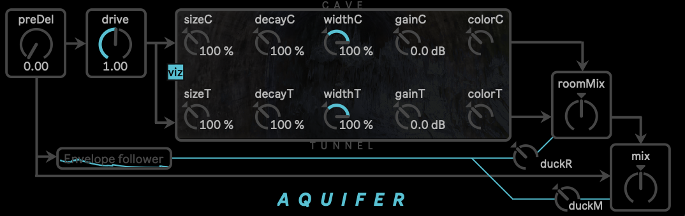

# Aquifer

Reactive dual reverb - M4L device

The device uses 2 Impulse responses: one recorded at the Škocjan cave and the other at Aurisina aqueduct tunnel.

- The "Aquifer" folder contains the .amxd
- The "AquiferMaxProject" is Aquifer as a Max project (with a loop ready to be played and additional dac~ as output)

Special features:
- Parameters for both reverbs are editable
- Distortion stages: pre and post reverbs 
- Envelope followers to modulate Mix (wet/Dry) and roomMix (balance between the 2 reverbs).

Aquifer has been developed in the framework of "SCAPES_under"
A project by
Liminal Research ETS

**With the support of**
- Regione Autonoma Friuli Venezia Giulia
- Comune di Staranzano
- Festival dell’Acqua di Staranzano

**Partners**
- GTS Gruppo Triestino Speleologi
- Skocjanske Jame Park.

**Credits**
- [Stefano D'Alessio](https://stefanodalessio.github.io/)
- [Liminal Research](https://www.liminalresearch.eu/)
- [Andrea Peluso](https://andrea-peluso.it)
- [Mauricio Valdes San Emeterio](https://mvsanemeterio.wixsite.com/mauriciovaldes)
